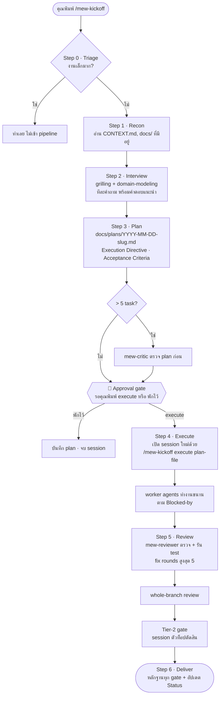

<div align="center">

# 🚀 mew-kickoff

**Pipeline "สัมภาษณ์จนถึงส่งมอบ" สำหรับ AI coding agent — ให้โมเดลตัวท็อปคิด ให้ตัวเล็กผลิต แล้วให้ตัวท็อปตรวจปิดงาน**

   

</div>

---

## มันคืออะไร

`mew-kickoff` คือ **skill** ตัวเดียวที่เปลี่ยนการ "สั่ง AI เขียนโค้ด" ให้เป็น pipeline ที่มีขั้นตอน มี gate และมีคนตรวจงานเสมอ:

1. AI **สัมภาษณ์**คุณทีละคำถามจนโจทย์ชัด ไม่เดาแทนคุณ
2. เขียน **plan** ที่ระบุว่างานแต่ละชิ้นให้ agent ตัวไหนทำ ด้วยโมเดลอะไร
3. หยุดรอคุณ **approve** ก่อนลงมือทุกครั้ง
4. กระจายงานให้ **worker agent** ทำในบริบทสด แยกจากบทสนทนาหลัก
5. **reviewer** ตรวจทุกชิ้น รัน build กับ test เอง แล้วโมเดลตัวท็อปเป็นคนตัดสินว่า "เสร็จ"
6. ส่งมอบพร้อมหลักฐานว่าผ่าน gate ไหนบ้าง

ใช้ได้กับ **Claude Code**, **OpenAI Codex CLI** และ **xAI Grok CLI** จาก source เดียวกัน

> ได้แรงบันดาลใจจาก [mattpocock/skills](https://github.com/mattpocock/skills) และ [superpowers](https://github.com/obra/superpowers) ขอบคุณทั้งสองโปรเจกต์

---

## หลักคิด 3 ข้อ

| หลัก | ความหมาย |
|---|---|
| **Effort economy** | จ่าย effort สูงสุดเฉพาะจุดที่ "การตัดสินใจ" ทบต้น: สัมภาษณ์, spec, review ไม่ใช่ตอนพิมพ์โค้ด |
| **Context economy** | session หลักเก็บบริบทของการสัมภาษณ์กับ plan ให้สะอาด งานผลิตไปเผาบริบทสดของ worker แทน |
| **Review independence** | คนเขียนไม่ใช่คนตัดสิน worker ผลิต, reviewer ตรวจ, session ปิดงาน |

ทำไมถึงเชื่อแบบนี้: เราวัดจริงจาก transcript 5 สัปดาห์ ($16k เทียบราคา API) พบว่า **65% ของต้นทุนคือ session หลักอ่าน context ยาว ๆ ซ้ำทุก turn** ส่วน output ที่ worker ผลิตทั้งหมดรวมกันไม่ถึง 1% ดังนั้นสถาปัตยกรรม "ท็อปคิด เล็กผลิต" ถูกแล้ว สิ่งที่ต้องคุมคือขนาดบริบทของ session หลัก (รายละเอียดใน [`docs/HANDOFF.md`](docs/HANDOFF.md))

---

## ภาพรวม pipeline



---

## ทีม agent 5 ตัว

| Agent | หน้าที่ | Claude Code | Codex | Grok |
|---|---|---|---|---|
| `mew-worker` | งานที่ spec ชัด: โค้ด, test, refactor, ผลิตชิ้นงานด้วย tool **(default)** | Sonnet 5 · high | gpt-5.6-sol · high | grok-4.6 · high |
| `mew-worker-heavy` | งานซับซ้อน หลายไฟล์ debug ยาก งานที่แตะ auth หรือ payment | Opus 5 · xhigh | gpt-5.6-sol · xhigh | grok-4.6 · xhigh |
| `mew-worker-mech` | งานกลไกล้วน: rename, แก้ typo, boilerplate ซ้ำ ๆ | Haiku 4.5 | gpt-5.6-sol · medium | grok-4.6 · medium |
| `mew-reviewer` | ตรวจงานทีละ task เทียบ spec + รัน build/test เอง | Sonnet 5 · high | gpt-5.6-sol · high | grok-4.6 · high |
| `mew-critic` | ตรวจงานที่ไม่ใช่โค้ดและตรวจ plan ด้วยบริบทสด ไม่เห็นบทสนทนา | Opus 5 · high | gpt-5.6-sol · high | grok-4.6 · high |

ตัว **session** (คุณคุยด้วย) ใช้โมเดลท็อปสุดที่มีที่ effort สูงสุด และลดลงหนึ่งขั้นตอนกระจายงานใน Step 4

ทุก agent รายงานกลับมาไม่เกิน 150 คำ แล้วเขียนรายงานเต็มลงไฟล์ เพื่อไม่ให้บทสนทนาหลักบวม

---

## ติดตั้ง

### 1) เตรียม CLI ที่จะใช้

> `install.sh` ในข้อ 2 จะเช็คของพวกนี้ให้และติดตั้งให้ถ้ายังไม่มี ข้อนี้อธิบายว่ามันคืออะไรและใช้คำสั่งอะไร เผื่อต้องทำเอง

<details>
<summary><b>Claude Code</b></summary>

ต้องมี plugin `superpowers` (เป็น execute loop) และ skill ชุดของ Matt Pocock (`grilling`, `domain-modeling`)

```bash
claude plugins install superpowers
npx skills@latest add mattpocock/skills -g -a '*'
```

คำสั่งที่สองจะถามว่าเอา skill ตัวไหน ให้เลือกอย่างน้อย `grilling`, `domain-modeling`, `tdd`, `research`, `wayfinder` เลือกทั้งหมดก็ได้ และเลือกให้ติดตั้งกับทุก agent (`*`) จะได้ใช้ร่วมกับ Codex และ Grok
</details>

<details>
<summary><b>OpenAI Codex CLI</b></summary>

```bash
npx skills@latest add mattpocock/skills -g -a '*'
codex features list | grep multi_agent   # ต้องเป็น stable true
```

Codex อ่าน skill จาก `~/.agents/skills/` และ agent จาก `~/.codex/agents/*.toml` ซึ่ง `install.sh` จะวางให้
</details>

<details>
<summary><b>xAI Grok CLI</b></summary>

```bash
npx skills@latest add mattpocock/skills -g -a '*'
```

Grok อ่าน skill จาก `~/.grok/skills/` และ `~/.agents/skills/` และอ่าน agent จาก `~/.grok/agents/*.md`
</details>

### 2) clone แล้วรัน install.sh

```bash
git clone git@github.com:mewic/mew-kickoff.git ~/projects/mew-kickoff
~/projects/mew-kickoff/install.sh
```

`install.sh` ทำ 2 อย่าง: ติดตั้ง prerequisite ที่ยังขาด (plugin `superpowers` ถ้ามี Claude Code และ skill ชุดของ Matt Pocock ถ้ายังไม่มี `grilling`/`domain-modeling`) แล้วสร้าง symlink จาก directory ของแต่ละ CLI มาที่ repo นี้ ไม่ copy ไฟล์ แก้ที่ repo ที่เดียวทุก CLI เห็นหมด รันซ้ำได้เสมอ

### 3) เปิด session ใหม่ แล้วเช็ค

CLI ทุกตัวอ่าน skill และ agent ตอนเริ่ม session เท่านั้น ปิดแล้วเปิดใหม่ก่อน จากนั้น:

```bash
bash ~/projects/mew-kickoff/skills/mew-kickoff/scripts/smoke.sh
```

ต้องเห็น `SMOKE: PASS` script นี้เช็ค pointer ทุกตัวที่ skill พึ่งพา ทั้งไฟล์ของ superpowers, agent ทั้ง 5, symlink และความเป็นกลางของ core

---

## วิธีใช้

| ทำอะไร | Claude Code | Codex | Grok |
|---|---|---|---|
| เริ่มงานใหม่ | `/mew-kickoff` | `$mew-kickoff` | `/mew-kickoff` |
| รัน plan ที่ approve แล้ว | `/mew-kickoff execute docs/plans/<file>.md` | `$mew-kickoff execute docs/plans/<file>.md` | `/mew-kickoff execute docs/plans/<file>.md` |

**สิ่งที่จะเกิดขึ้น**

1. ถ้างานเล็กมาก (ไม่มี design decision, แตะไม่เกิน 2 ไฟล์) AI จะบอกว่า "งานนี้เข้าเกณฑ์ off-ramp" แล้วทำเลย พิมพ์ `เข้า pipeline เต็ม` ถ้าอยากบังคับ
2. AI ถามทีละคำถาม พร้อมคำตอบที่แนะนำ **ข้อเท็จจริง**มันไปหาเอง **การตัดสินใจ**มันจะรอคุณเสมอ
3. ได้ plan ที่มีตาราง Execution Directive บอกว่าใครทำอะไร blocked by อะไร และ Acceptance Criteria ที่เช็คได้
4. AI หยุดที่ **approval gate** ตอบ `execute` เพื่อไปต่อ หรือ `พักไว้` เพื่อเก็บ plan ไว้ทำวันหลัง
5. ตอน execute แนะนำให้ **เปิด session ใหม่** แล้วสั่ง `execute <plan-file>` เพื่อให้บริบทสะอาด และลด effort ของ session ลงหนึ่งขั้น (`/effort high` ใน Claude Code) แล้วกลับเป็นสูงสุดตอน gate สุดท้าย
6. งานเสร็จ AI รายงานพร้อมหลักฐาน build/test, checklist ของ criteria และอัปเดตบรรทัด Status ใน plan

**เอกสารที่ pipeline สร้างในโปรเจกต์ของคุณ**

```
CONTEXT.md            glossary ของโปรเจกต์ (อัปเดตในที่ ไม่สร้างใหม่)
docs/adr/             decision records
docs/plans/           plan ต่อ 1 งาน ขึ้นต้นด้วยวันที่ ลบได้หลังส่งมอบ
docs/plans/reports/   รายงานเต็มของ worker/reviewer
docs/research/        ผล research จาก primary source
docs/deliverables/    งานที่ไม่ใช่โค้ด เช่น strategy doc
```

---

## โครงสร้าง repo

```
skills/mew-kickoff/
  SKILL.md                 กระบวนการ กลางทุก CLI
  adapters/claude.md       วิธี dispatch, effort, security review, ตาราง model สำหรับ Claude Code
  adapters/codex.md        เช่นเดียวกันสำหรับ Codex
  adapters/grok.md         เช่นเดียวกันสำหรับ Grok
  adapters/loop.md         execute loop ขั้นต่ำสำหรับ CLI ที่ไม่มี superpowers
  map.md                   วิธีเขียน "map" เมื่องานใหญ่เกิน 1 plan
  ultracode.md             เกณฑ์เสนอ review แบบ multi-agent (Claude Code)
  agents/openai.yaml       metadata สำหรับ Codex
  scripts/smoke.sh         ตัวเช็คว่าทุก pointer ยังใช้ได้
agents/claude|codex|grok/  นิยาม agent 5 ตัวของแต่ละ CLI
docs/                      plan, รายงาน critic, ผลทดสอบข้าม CLI, research, handoff
scripts/                   script วัด token และต้นทุนจาก transcript ของ Claude Code
install.sh                 สร้าง symlink เข้า CLI ทั้งสาม
```

---

## ปรับให้เป็นของคุณ

| อยากเปลี่ยน | แก้ที่ไหน |
|---|---|
| ชื่อผู้ใช้ (ตอนนี้ skill เรียกคุณว่า "Mew") | แทนคำว่า `Mew` ใน `skills/mew-kickoff/SKILL.md`, `adapters/*.md` และ `agents/*/mew-*` ด้วยชื่อคุณ หรือปล่อยไว้ก็ได้ AI เข้าใจว่าหมายถึงคุณ |
| model หรือ effort ของ agent | Claude: frontmatter ใน `agents/claude/*.md` · Codex: `model` และ `model_reasoning_effort` ใน `agents/codex/*.toml` · Grok: `model:` และ `effort:` ใน `agents/grok/*.md` |
| model ของ session | Claude: `/model` และ `/effort` · Codex: `~/.codex/config.toml` · Grok: `~/.grok/config.toml` |
| ภาษาที่ใช้สัมภาษณ์ | หัวข้อ **Language** ใน `SKILL.md` (ค่าเริ่มต้น: เอกสารเทคนิคอังกฤษ สัมภาษณ์ไทย) |
| เพิ่ม agent ตัวที่ 6 | เพิ่มไฟล์ใหม่ใน `agents/<cli>/` แล้วอ้างชื่อใน Execution Directive อย่าแก้ไฟล์ agent ระหว่างที่มี session รันอยู่ |

แก้เสร็จให้รัน `smoke.sh` และเปิด session ใหม่เสมอ

---

## คำถามที่พบบ่อย

**พิมพ์ `/mew-kickoff` แล้วไม่ขึ้น** — เปิด session ใหม่หรือยัง? skill ถูกอ่านตอนเริ่ม session และตั้งใจให้ AI มองไม่เห็นในรายการอัตโนมัติ คุณต้องเป็นคนเรียกเอง

**AI บอกว่า Skill tool ปฏิเสธ `grill-with-docs`** — คุณใช้ skill เวอร์ชันเก่า อัปเดต repo แล้วรัน `smoke.sh`

**แก้ไฟล์ agent แล้วไม่มีผล** — ไฟล์ agent มีผลกับ session ใหม่เท่านั้น ทุก CLI

**ทำไม Codex กับ Grok ใช้โมเดลเดียวทุก role** — ทั้งสองเป็น subscription เหมาจ่าย จึงแยกระดับด้วย effort แทน ถ้าอยากใช้โมเดลเล็กลงให้แก้ในไฟล์ agent ได้เลย

**ช้าและกิน token** — ปกติสำหรับงาน 7 ถึง 11 task (ราว 3 ถึง 5 ชั่วโมง) สิ่งที่ช่วยมากสุดคือ execute ใน session ใหม่ และอย่าให้ session หลักอ่านไฟล์เอง ใช้ `scripts/usage_by_model.py` วัดของคุณเองได้

---

## เครดิต

- [mattpocock/skills](https://github.com/mattpocock/skills) — grilling, domain-modeling, wayfinder, writing-for-agents และวิธีคิดเรื่อง skill ทั้งหมด
- [superpowers](https://github.com/obra/superpowers) — subagent-driven-development ที่เป็น execute loop ของฝั่ง Claude Code
- [agentskills.io](https://agentskills.io) — สเปก SKILL.md ที่ทำให้ใช้ข้าม CLI ได้

Private repo สำหรับนักเรียนของ Mew · ถามได้ในคลาส
